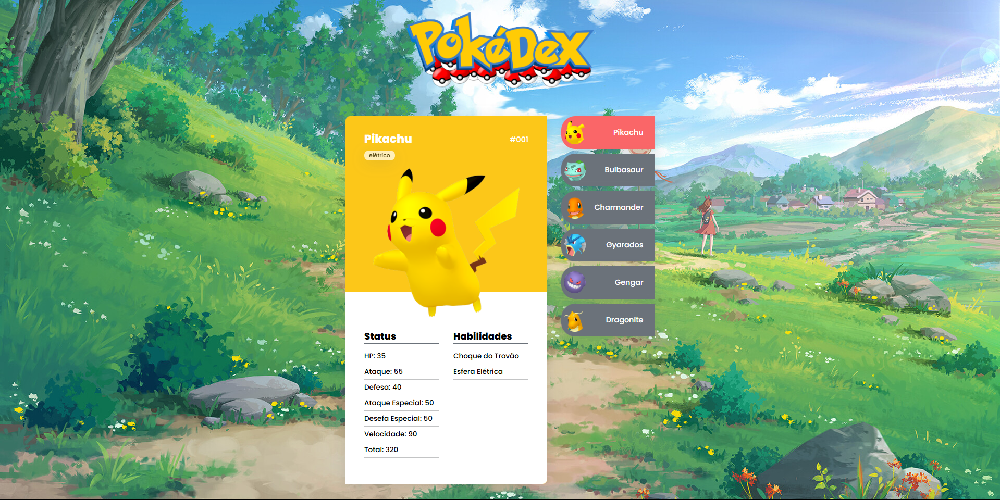

# 📘 Mini Pokédex
Uma pequena Pokédex feita para fins de aprendizado e prática de front-end, exibindo informações de Pokémon de forma interativa e visualmente agradável.

 

## ✨ Funcionalidades
- Visualização de informações básicas dos Pokémon
- Lista lateral para navegar entre diferentes Pokémon
- Layout responsivo com fundo ilustrado
- Destaque para o Pokémon selecionado com imagem e estatísticas

## 🛠️ Tecnologias Utilizadas

- HTML5
- CSS3 (ou Tailwind, caso esteja usando)
- JavaScript
- Imagens e sprites personalizados


## 🚀 Como Rodar o Projeto

1. Clone o repositório:
   ```bash
   git clone https://github.com/seu-usuario/nome-do-projeto.git
